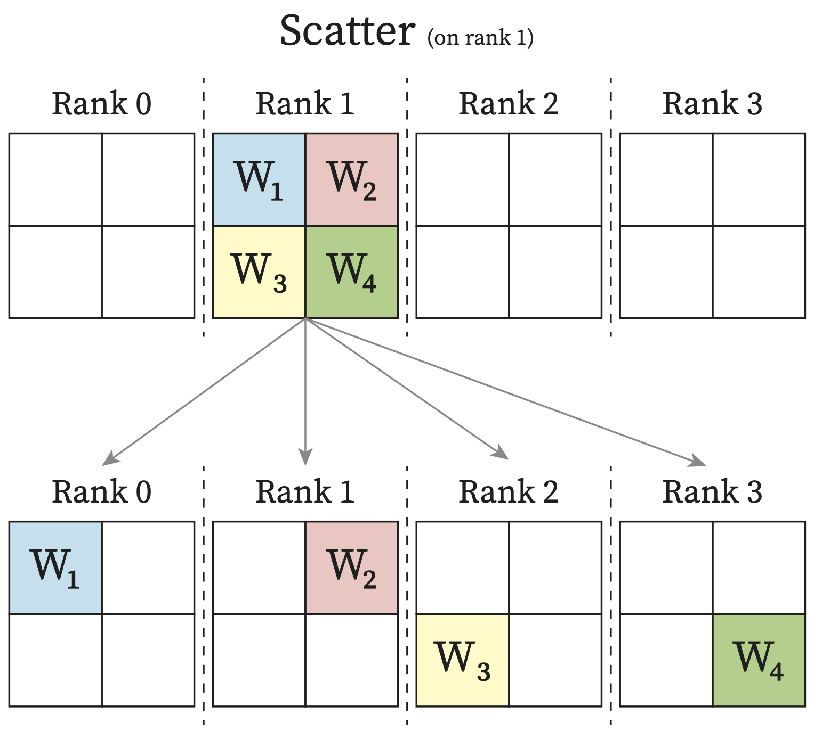

# Distributed GPU Computing
One can decide to use multiple GPUs on their AI/ML applications for different reasons including but not limited to:
* Handling large-scale datasets
* Hyperparameter tuning
* Train/inferece large-scale Model that does not fit into the memory of a single GPU. 

## Inter GPU Communication
In majority of use-cases of multi-GPU computation there is the need for different GPU to communicate and send their partail computation to one another to sync. NCCL libarary from NVIDIA is widely in use for NIVIDA based GPU communication.
### NVIDIA Collective Communication Library (NCCL)
For multi-GPU and multi-node communication, NVIDIA Collective Communication Library (NCCL, pronounced “Nickel”) is being used as backend in distributed strategies for Nvidia GPUs such as Distributed Data Parallel (DDP) and Fully Sharded Data Parallel (FSDP). Following are some of the most related NCCL collective communication primitives :
* Scatter: From one rank, data will be distributed across all rank, with each rank receiving a subpart of the data.
* Gather: One rank will receive the aggregation of data from all ranks.
* AllGather: Each rank receives the aggregation of data from all ranks in the order of the ranks.
* Reduce: One rank receives the reduction of input values across ranks.
* AllReduce: Each rank receives the reduction of input values across ranks.
* ReduceScatter: Input values are reduced across ranks, with each rank receiving a subpart of the result.
```{seealso}
For more information about the different NCCL collective operations refer to:
https://docs.nvidia.com/deeplearning/nccl/user-guide/docs/usage/collectives.html
``` 
```{note}
Each process in the multi-process applications is called a rank. Usually each process has its own exclusive device. Therefore you can think of each rank as one GPU in the following diagrams.
```

````{list-table} Inter-GPU Collective Communication Primitives.
:header-rows: 0

* - 
   - 
* - 
   - 
* - 
   - 
````
## Distributed Training Strategies
### Simple MLP Network
To go over the different distributed computing strategies that have been used widely in AI/ML community, let's consider the following simple example.
```{figure} figures/png/mlp_network.png
---
height: 300px
name: mlp_network
---
A 2-Layer MLP Network.
```
{numref}`mlp_matrices` shows the input, output of the above network as well as the weight and bias tensors of each layer in {numref}`mlp_network`
```{figure} figures/png/mlp_matrices.png
---
height: 200px
name: mlp_matrices
---
Input, output, weight and bias matrices of the mlp model in {numref}`mlp_network`.
```
* Forward Pass Computations
* Loss Calculation
* Backward Pass Computations
* Updating the Model